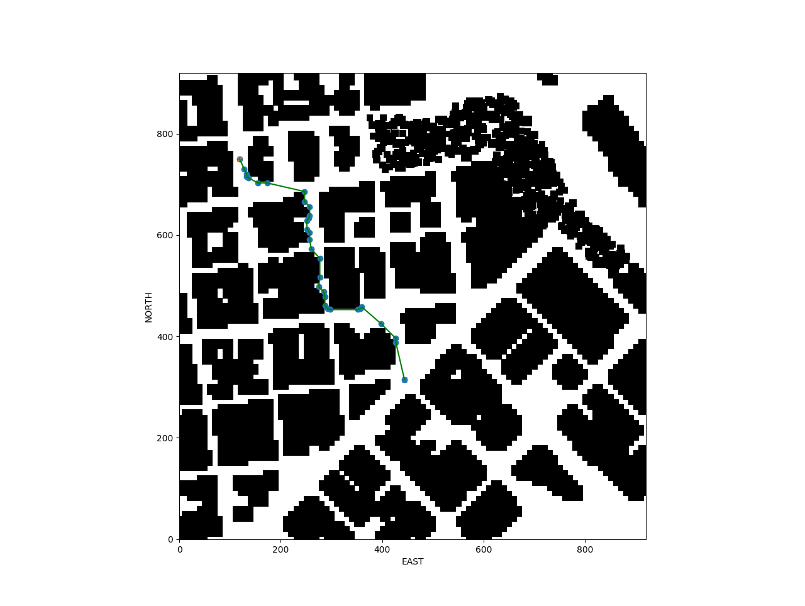

## Project: 3D Motion Planning


---

## Writeup
1. Provide a Writeup / README that includes all the rubric points and how you addressed each one. You can submit your writeup as markdown or pdf.
---
## Explain the Starter Code.
2. Test that motion_planning.py is a modified version of backyard_flyer_solution.py for simple path planning. Verify that both scripts work. Then, compare them side by side and describe in words how each of the modifications implemented in motion_planning.py is functioning.
* Both script work. motion_planning.py has an additional send_waypoints function and a plan_path function to generate a path through the loaded grid('colliders.csv'). These waypoints are then send to the simulator which executes the flight plan through downtown San Francisco.
---
## Implementing Your Path Planning Algorithm
3. In the starter code, we assume that the home position is where the drone first initializes, but in reality you need to be able to start planning from anywhere. Modify your code to read the global home location from the first line of the colliders.csv file and set that position as global home (self.set_home_position())

* The following function loads the first line from the colliders.csv file and returns the lat and long values
```
def get_lat_lon(colliders):
    with open(colliders) as f:
        line0 = f.readline()
        lat0_lon0 = line0.replace('lat0 ', '').replace('lon0 ', '')
        lat0, lon0 = [float(x) for x in lat0_lon0.split(',')]

    return lat0, lon0
```
* This function is then used in the plan_path function in the MotionPlanning class to set the global home position as follows:
```
# read lat0, lon0 from colliders into floating point values
lat0, lon0 = get_lat_lon(colliders)

# set home position to (lon0, lat0, 0)
self.set_home_position(lon0, lat0, 0.)
```

4. In the starter code, we assume the drone takes off from map center, but you'll need to be able to takeoff from anywhere. Retrieve your current position in geodetic coordinates from self._latitude, self._longitude and self._altitude. Then use the utility function global_to_local() to convert to local position (using self.global_home as well, which you just set)

* The property global_position is made up out of self._longitude, self._latitude, self._altitude. This is used to in the global_to_local function to get the current local position. See below:
```
@property
def global_position(self):
    return np.array([self._longitude, self._latitude, self._altitude])

current_local_position = global_to_local(current_global_position, global_home_position)
```

5. In the starter code, the start point for planning is hardcoded as map center. Change this to be your current local position.
* the current_local_position that was obtained the the previous step is now used together with the north and east offset to set the starting position for our path finding algorithm:
```
grid, north_offset, east_offset = create_grid(data, TARGET_ALTITUDE, SAFETY_DISTANCE)

grid_start = (int(current_local_position[0] - north_offset),
              int(current_local_position[1] - east_offset))
```

6. In the starter code, the goal position is hardcoded as some location 10 m north and 10 m east of map center. Modify this to be set as some arbitrary position on the grid given any geodetic coordinates (latitude, longitude)
* For the goal position a challenging location in the middle of some buildings was chosen to test the effectiveness of the search algorithm as well as the path pruning.
```
goal_lon_lat = (-122.39095753, 37.80205495, 0.)
local_goal_position = global_to_local(goal_lon_lat, global_home_position)
grid_goal = (int(local_goal_position[0] + north_offset),
             int(local_goal_position[1] + east_offset))
```

7. Write your search algorithm. Minimum requirement here is to add diagonal motions to the A* implementation provided, and assign them a cost of sqrt(2). However, you're encouraged to get creative and try other methods from the lessons and beyond!
* the A* implementation has been updated to include diagonal motions as well as an improved heuristics function and advanced path pruning. These functions can be found in planning_utils.py

8. Cull waypoints from the path you determine using search.
path pruning and bresenham raytracing is used to determine the shortest path. The order of application is being tested and the shortest path is used:
```
def optimize_path(grid, path):
    print('prune, then bresenham')
    pruned_path = prune_path(path)
    print(len(pruned_path))
    prune_bresenham = bresenham_raytracing(grid, pruned_path)
    print(len(prune_bresenham))

    print('bresenham, then prune')
    bresenham_path = bresenham_raytracing(grid, path)
    print(len(bresenham_path))
    bresenham_prune = prune_path(bresenham_path)
    print(len(bresenham_prune))

    print('using shortest path')

    path = min([prune_bresenham, bresenham_prune], key=len)

    return path
```

---
## Executing the flight
9. This is simply a check on whether it all worked. Send the waypoints and the autopilot should fly you from start to goal!
* Below is the final path between the start and goal locations that the autopilot will fly.

(Buildings are not loading in the sim on my current setup. The quad does fly the given path without any problems and lands after the path has been flown. See this [issue](https://github.com/udacity/FCND-Simulator-Releases/issues/11))
